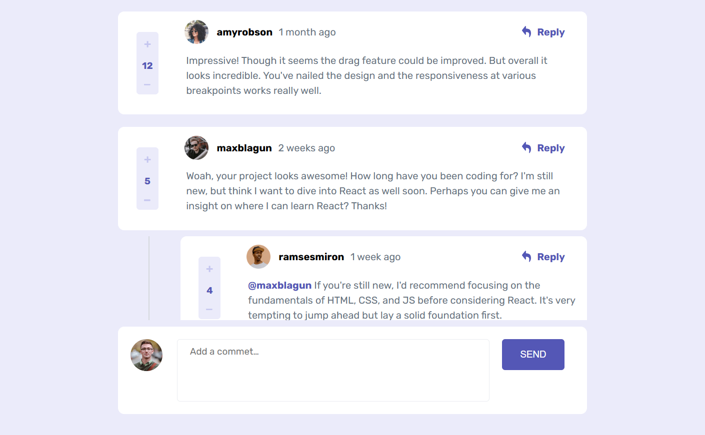
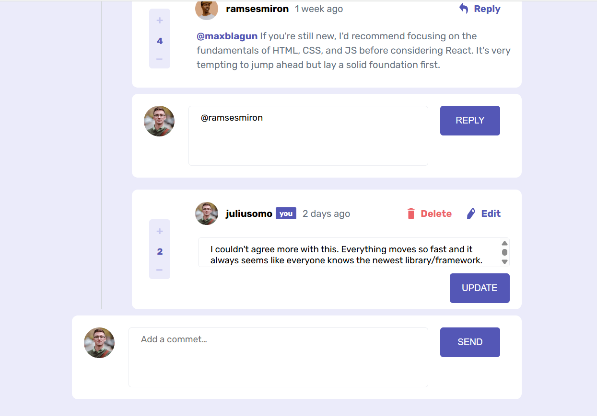
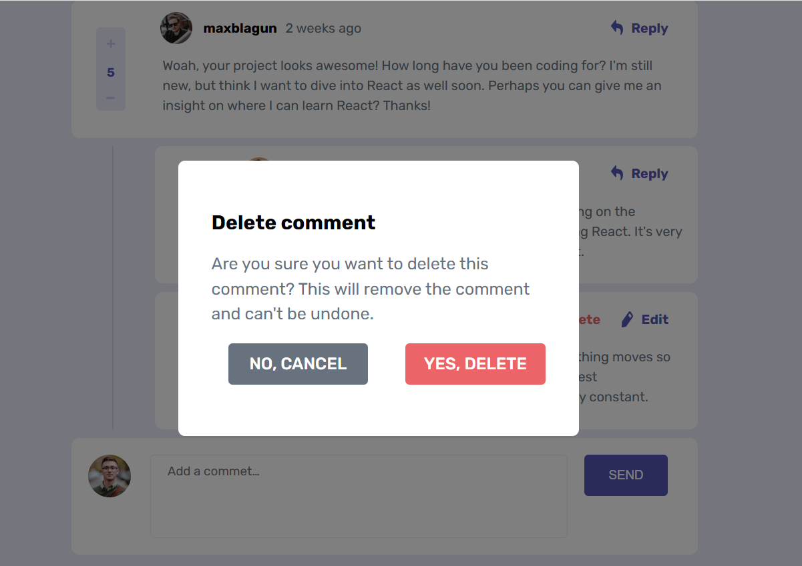
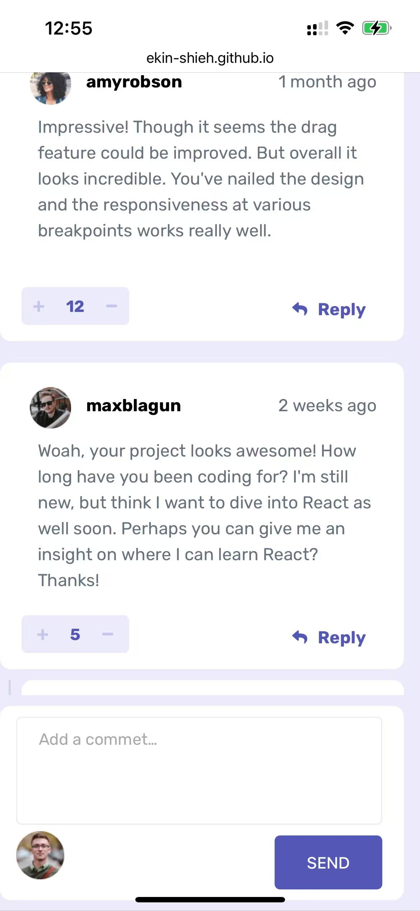

# Frontend Mentor - Interactive comments section solution

This is a solution to the [Interactive comments section challenge on Frontend Mentor](https://www.frontendmentor.io/challenges/interactive-comments-section-iG1RugEG9). Frontend Mentor challenges help you improve your coding skills by building realistic projects. 

## Table of contents

- [Overview](#overview)
  - [The challenge](#the-challenge)
  - [Screenshot](#screenshot)
  - [Links](#links)
- [My process](#my-process)
  - [Built with](#built-with)
  - [What I learned](#what-i-learned)
  - [Continued development](#continued-development)
- [Author](#author)

## Overview

### The challenge

Users should be able to:

- View the optimal layout for the app depending on their device's screen size
- See hover states for all interactive elements on the page
- Create, Read, Update, and Delete comments and replies
- Upvote and downvote comments
- **Bonus**: If you're building a purely front-end project, use `localStorage` to save the current state in the browser that persists when the browser is refreshed.
- **Bonus**: Instead of using the `createdAt` strings from the `data.json` file, try using timestamps and dynamically track the time since the comment or reply was posted.

### Screenshot

### Links

- Solution URL: [the solution in github](https://github.com/Ekin-shieh/interactive-commets)
- Live Site URL: [the live site in gitpage](https://ekin-shieh.github.io/interactive-commets/)

## My process

### Built with

- 🧠 **TypeScript** – A strongly typed JavaScript superset that improves development experience and maintainability
- 🎨 **CSS (Flexbox, Grid, Positioning)** – Implement responsive comment layout and interactive structure
- 🧩 **HTML5 Semantic Elements** – Use structural tags properly to enhance accessibility
- 🖱️ **DOM Manipulation (Vanilla JS / TS)** – Dynamic rendering of comment area, add, delete, reply, edit and other functions
- 💬 **Front-end state management (no framework)** – Use local variables or data structures to manage UI state
- 📦 **Modular development (ES Modules)** – Split JS/TS files for clearer logic (if you use `import/export`)
- 📐 **Responsive Design** – Use media queries and layout switching to optimize mobile display
- 📄 **Custom pop-up window component** – Implement pop-up window logic such as deletion confirmation

### What I learned

#### 🧠 TypeScript
- How to safely use type assertions (e.g. `as HTMLDivElement`) to handle event targets.
- Use `event delegation` to implement unified monitoring and processing of multiple buttons.

#### 🎨 CSS & Layout
- Combination of `flex`, `grid`, `position`.
- Usage of `display: contents` and its precautions.
- How to refactor mobile layout logic through `media queries`.

#### 🧩 JavaScript/DOM Operations
- Manually implement the functions of adding, deleting, editing, and replying comments.
- How to extract and re-render the highlight effect of `@username` mention.

### Continued development

This project is planned to be integrated into a larger full-stack application, where the interactive comments section will serve as a core UI module. Future improvements include refactoring and simplifying TypeScript logic by extracting reusable functions and reducing code redundancy. In addition, the HTML structure will be reorganized to group commonly co-occurring elements into unified containers, ensuring clearer component boundaries and a more maintainable layout system.

## Author

- Frontend Mentor - [@Ekin-shieh](https://www.frontendmentor.io/profile/Ekin-shieh)
- GitHub - [@Ekin-shieh](https://github.com/Ekin-shieh)